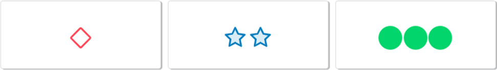
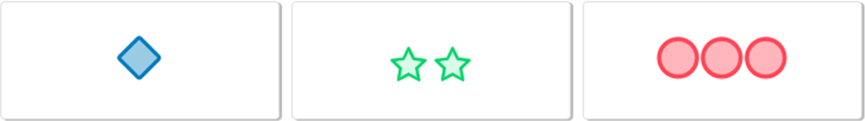
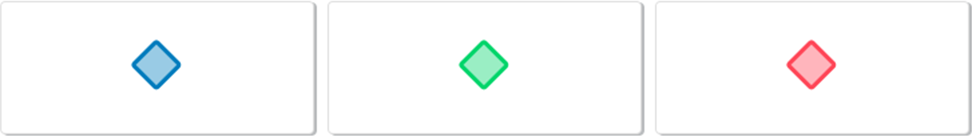
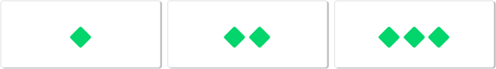

# **<a href="https://setgame.netlify.com">SET</a>**

*An implementation of the card game <a href="https://en.wikipedia.org/wiki/Set_(card_game)">'SET'</a> made using React, Bootstrap, CSS and Javascript.*

# **What defines a SET?**
Each card in the game has four traits which are:
  1. The shapes
  2. The *number* of shapes
  3. The *color* of the shapes
  4. The *fill* of the shapes

A **SET** is a group of three cards that share the same traits in common across all three cards.

  **
The cards can have nothing in common
**
  

  **
The cards can have one trait in common
**
  

  **
The cards can have two traits in common
**
  

  **
The cards can have three traits in common
**
  

# **How to Play**

Once you have selected your three cards, simply hit the 'submit' button and one of two things will happen:

  1. The 'SET' is valid so you will gain a point and the cards you submitted will be replaced with new ones.

  2. The cards you submitted are not a 'SET' so the app will clear your selection and display a message informing to that effect.

It is possible that will be a board of cards where there is no set. If you believe this to be the case you may press the 'no set' button and one of two things will happen:

  1. There is no set present so you will get a point and a new board will be generated.
  
  2. There is a set, you will not get a point and the app will display a messaging informing you of such.

# **Planned Features**
### **Persistent Game State**
  * Save and load the pertinent information to local storage.
  * Give the user the option to connect the gamestate to a db to save the game state across multiple devices.
### **Hints**
  * Possibly a button or a timer based hint system that either provides text based hints or a visual cue indicating which cards are part of the set.
### **Deeper Scoring system**
  * Incorporating a timer, finding a set faster earns you more points.
  * Point penalty for submitting an invalid set/incorrectly declaring no set.
  * Point penalty for using the hint system if the hint system is made deliberate.
